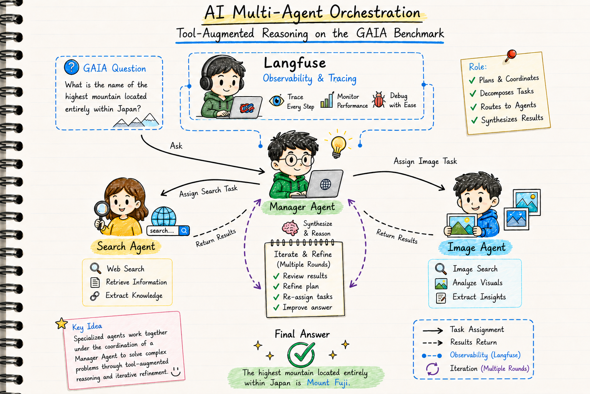
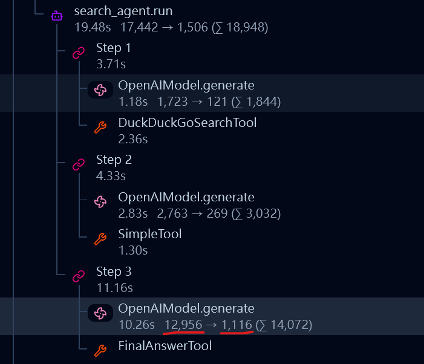
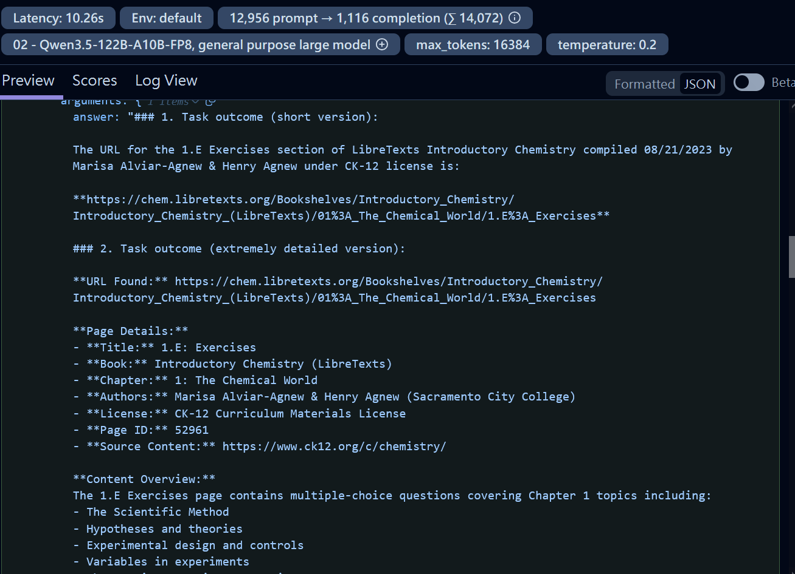
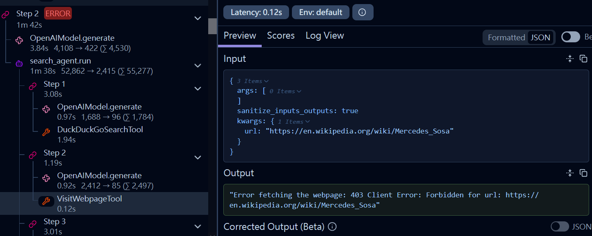
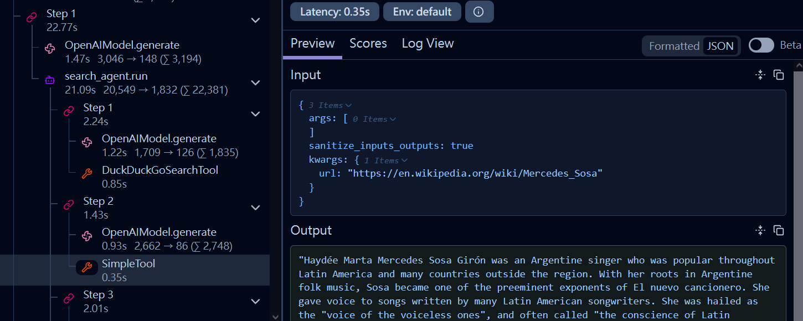

# **AI Multi-Agent Orchestration: Tool-Augmented Reasoning on the GAIA Benchmark**

## **Project Description**

This project implements an advanced autonomous agent system designed to tackle the **GAIA (General AI Assistants)** benchmark. Unlike traditional chatbots, this agent utilizes a multi-agent orchestration framework to solve complex, multi-modal tasks that require real-world reasoning, tool usage, and information synthesis.

The system is built on the [smolagents](https://github.com/huggingface/smolagents) framework, featuring a hierarchical agent structure. A **Manager Agent** (CodeAgent) plans and delegates tasks to specialized sub-agents for web searching and vision-based analysis. This approach allows the agent to navigate the web, analyze images, process diverse file formats (CSV, JSON, Excel), and perform multi-step reasoning to reach accurate conclusions for difficult real-world questions.



### **Key Capabilities**

| Capability | Description |
|---|---|
| **Multi-Agent Orchestration** | A hierarchical design where a Manager Agent plans and coordinates specialized search and vision agents. |
| **Autonomous Web Search** | Integrated `DuckDuckGoSearchTool` and webpage visitation to retrieve real-time information from the internet. |
| **Multi-Modal Analysis** | Native support for analyzing images and structured data files (CSV, XLSX, JSON) using Python-based logic. |
| **Robust File Handling** | A specialized GAIA file resolver to manage local and remote resources, ensuring high reliability during evaluation. |
| **Telemetry & Tracing** | Full integration with **Langfuse** via OpenTelemetry for granular monitoring of agent steps and performance. |

## **Installation**

### **Prerequisites**

- Python **3.12+**
- A [Gemini API key](https://aistudio.google.com/app/apikey) or [Blablador API key](https://helmholtz-blablador.fz-juelich.de/)
- Git

### **Steps**

1. **Clone the repository**
   ```bash
   git clone https://github.com/Thomas-Chou/Agent_Gaia.git
   cd Agent_Gaia
   ```

2. **Create and activate a virtual environment** *(recommended)*
   ```bash
   python -m venv .venv
   # Windows
   .venv\Scripts\activate
   # macOS / Linux
   source .venv/bin/activate
   ```

3. **Install dependencies**
   ```bash
   pip install -r requirements.txt
   ```

4. **Configure environment variables**

   Create a `.env` file in the project root and add your keys:
   ```env
   GEMINI_API_KEY=your_gemini_key
   Blablador_API_KEY=your_blablador_key
   LANGFUSE_PUBLIC_KEY=your_public_key
   LANGFUSE_SECRET_KEY=your_secret_key
   LANGFUSE_HOST=https://cloud.langfuse.com
   ```

---

## **Usage**

### **1. Run the Gradio App — `app.py`**

The project includes a Gradio-based web interface for running and monitoring evaluations.

```bash
python app.py
```

**Features:**
- **Standard Evaluation**: Runs the agent against the GAIA benchmark questions.
- **Test Mode**: Runs a limited set of questions (first 5) for quick validation.
- **Specific Question**: Target a single question index to debug specific failures.
- **Auto-Submission**: Automatically submits results to the scoring endpoint.

### **2. Agent Core — `agent.py`**

The `BasicAgent` class encapsulates the multi-agent logic. It can be used programmatically in other scripts:

```python
from agent import BasicAgent

agent = BasicAgent(model_provider="Gemini")
answer = agent("What is the current population of Paris according to the latest official census?")
print(answer)
```

---

## **Project Structure**

```
Agent_Gaia/
│
├── app.py                  # Gradio UI & Evaluation runner
├── agent.py                # Core BasicAgent implementation (Multi-agent logic)
├── requirements.txt        # Python dependencies
│
├── prompt/                 # System prompt templates
│   └── system_prompt.yaml  # Main system prompt for the agent
│
├── utils/                  # Helper modules
│   ├── agent_tools.py      # Custom tools (visit_webpage, etc.)
│   ├── gaia_files.py       # GAIA dataset file path resolver
│   └── blablador_helper.py # Blablador API wrapper
│
└── pics/                   # Visual documentation and debug screenshots
```

## **Technical Highlights: Multi-Agent Efficiency & Problem Solving**

### **1. Why a Search Agent is Essential**
If the Manager Agent attempts to search and process documents directly, it often faces an overwhelming amount of raw data, much of which is irrelevant. This "data noise" can cause the agent to lose focus or exceed token limits. 

By using a specialized **Search Agent**, we delegate the task of data retrieval and synthesis. The Search Agent explores the web, filters the noise, and returns a condensed, well-organized report to the Manager.

*   **Efficiency Gain**: In one instance, **12,956 tokens** of raw search data were condensed into a highly relevant **1,116-token** report.




### **2. Overcoming Wikipedia's 403 Forbidden Error**
Through **Langfuse** telemetry, we identified that the agent was frequently blocked when trying to read Wikipedia articles using standard scraping methods, resulting in `403 Forbidden` errors.



**The Fix**: We implemented a custom `visit_webpage` tool that detects Wikipedia links and redirects the request to **Wikipedia's REST API**. This provides clean, structured JSON content, completely bypassing the need for scraping and resolving the access issue.



---

## **Results & Performance**

The system was evaluated against the **GAIA Benchmark**, which tests an AI’s ability to execute multi-step, multi-modal tasks that humans find intuitive but models often struggle with. The results below illustrate the agent's capacity for autonomous reasoning across diverse modalities.

 <table border="1" class="dataframe">
  <thead>
    <tr style="text-align: left;">
      <th>Question</th>
      <th>Submitted Answer</th>
    </tr>
  </thead>
  <tbody>
    <tr>
      <td>How many studio albums were published by Mercedes Sosa between 2000 and 2009 (included)? You can use the latest 2022 version of english wikipedia.</td>
      <td>5</td>
    </tr>
    <tr>
      <td>In the video https://www.youtube.com/watch?v=L1vXCYZAYYM, what is the highest number of bird species to be on camera simultaneously?</td>
      <td>3</td>
    </tr>
    <tr>
      <td>.rewsna eht sa "tfel" drow eht fo etisoppo eht etirw ,ecnetnes siht dnatsrednu uoy fI</td>
      <td>right</td>
    </tr>
    <tr>
      <td>Review the chess position provided in the image. It is black's turn. Provide the correct next move for black which guarantees a win. Please provide your response in algebraic notation.</td>
      <td>Qc2+</td>
    </tr>
    <tr>
      <td>Who nominated the only Featured Article on English Wikipedia about a dinosaur that was promoted in November 2016?</td>
      <td>FunkMonk</td>
    </tr>
    <tr>
      <td>Given this table defining * on the set S = {a, b, c, d, e}\n\n|*|a|b|c|d|e|\n|---|---|---|---|---|---|\n|a|a|b|c|b|d|\n|b|b|c|a|e|c|\n|c|c|a|b|b|a|\n|d|b|e|b|e|d|\n|e|d|b|a|d|c|\n\nprovide the subset of S involved in any possible counter-examples that prove * is not commutative. Provide your answer as a comma separated list of the elements in the set in alphabetical order.</td>
      <td>b,e</td>
    </tr>
    <tr>
      <td>Examine the video at https://www.youtube.com/watch?v=1htKBjuUWec.\n\nWhat does Teal'c say in response to the question "Isn't that hot?"</td>
      <td>Extremely</td>
    </tr>
    <tr>
      <td>What is the surname of the equine veterinarian mentioned in 1.E Exercises from the chemistry materials licensed by Marisa Alviar-Agnew &amp; Henry Agnew under the CK-12 license in LibreText's Introductory Chemistry materials as compiled 08/21/2023?</td>
      <td>Louvrier</td>
    </tr>
    <tr>
      <td>I'm making a grocery list for my mom, but she's a professor of botany and she's a real stickler when it comes to categorizing things. I need to add different foods to different categories on the grocery list, but if I make a mistake, she won't buy anything inserted in the wrong category. Here's the list I have so far:\n\nmilk, eggs, flour, whole bean coffee, Oreos, sweet potatoes, fresh basil, plums, green beans, rice, corn, bell pepper, whole allspice, acorns, broccoli, celery, zucchini, lettuce, peanuts\n\nI need to make headings for the fruits and vegetables. Could you please create a list of just the vegetables from my list? If you could do that, then I can figure out how to categorize the rest of the list into the appropriate categories. But remember that my mom is a real stickler, so make sure that no botanical fruits end up on the vegetable list, or she won't get them when she's at the store. Please alphabetize the list of vegetables, and place each item in a comma separated list.</td>
      <td>broccoli, celery, fresh basil, lettuce, sweet potato</td>
    </tr>
    <tr>
      <td>Hi, I'm making a pie but I could use some help with my shopping list. I have everything I need for the crust, but I'm not sure about the filling. I got the recipe from my friend Aditi, but she left it as a voice memo and the speaker on my phone is buzzing so I can't quite make out what she's saying. Could you please listen to the recipe and list all of the ingredients that my friend described? I only want the ingredients for the filling, as I have everything I need to make my favorite pie crust. I've attached the recipe as Strawberry pie.mp3.\n\nIn your response, please only list the ingredients, not any measurements. So if the recipe calls for "a pinch of salt" or "two cups of ripe strawberries" the ingredients on the list would be "salt" and "ripe strawberries".\n\nPlease format your response as a comma separated list of ingredients. Also, please alphabetize the ingredients.</td>
      <td>cornstarch, lemon juice, ripe strawberries, salt, sugar, vanilla extract</td>
    </tr>
    <tr>
      <td>Who did the actor who played Ray in the Polish-language version of Everybody Loves Raymond play in Magda M.? Give only the first name.</td>
      <td>Wojciech</td>
    </tr>
    <tr>
      <td>What is the final numeric output from the attached Python code?</td>
      <td>0</td>
    </tr>
    <tr>
      <td>How many at bats did the Yankee with the most walks in the 1977 regular season have that same season?</td>
      <td>519</td>
    </tr>
    <tr>
      <td>Hi, I was out sick from my classes on Friday, so I'm trying to figure out what I need to study for my Calculus mid-term next week. My friend from class sent me an audio recording of Professor Willowbrook giving out the recommended reading for the test, but my headphones are broken :(\n\nCould you please listen to the recording for me and tell me the page numbers I'm supposed to go over? I've attached a file called Homework.mp3 that has the recording. Please provide just the page numbers as a comma-delimited list. And please provide the list in ascending order.</td>
      <td>Unable to process - no audio transcription tool available</td>
    </tr>
    <tr>
      <td>On June 6, 2023, an article by Carolyn Collins Petersen was published in Universe Today. This article mentions a team that produced a paper about their observations, linked at the bottom of the article. Find this paper. Under what NASA award number was the work performed by R. G. Arendt supported by?</td>
      <td>80GSFC21M0002</td>
    </tr>
    <tr>
      <td>Where were the Vietnamese specimens described by Kuznetzov in Nedoshivina's 2010 paper eventually deposited? Just give me the city name without abbreviations.</td>
      <td>Saint Petersburg</td>
    </tr>
    <tr>
      <td>What country had the least number of athletes at the 1928 Summer Olympics? If there's a tie for a number of athletes, return the first in alphabetical order. Give the IOC country code as your answer.</td>
      <td>CUB</td>
    </tr>
    <tr>
      <td>Who are the pitchers with the number before and after Taishō Tamai's number as of July 2023? Give them to me in the form Pitcher Before, Pitcher After, use their last names only, in Roman characters.</td>
      <td>Yoshida, Uehara</td>
    </tr>
    <tr>
      <td>The attached Excel file contains the sales of menu items for a local fast-food chain. What were the total sales that the chain made from food (not including drinks)? Express your answer in USD with two decimal places.</td>
      <td>89706.00</td>
    </tr>
    <tr>
      <td>What is the first name of the only Malko Competition recipient from the 20th Century (after 1977) whose nationality on record is a country that no longer exists?</td>
      <td>Claus</td>
    </tr>
  </tbody>
</table>

### **Key Performance Insights**

The evaluation results (detailed in the table above) highlight several critical strengths of the multi-agent architecture:

*   **Benchmark Performance**: The agent currently achieves a **80% accuracy rate** on the GAIA evaluation set, demonstrating strong foundational reasoning and tool usage.

*   **Dynamic Reasoning**: By leveraging a `CodeAgent` for orchestration, the system autonomously writes and executes Python logic to manipulate complex datasets and verify external findings.

*   **Precision Information Synthesis**: The agent excels at cross-referencing live web data, such as identifying specific Wikipedia article nominators and historical competition winners.

*   **Multimodal Proficiency**: Successful execution of vision-based tasks, including chess move prediction and video-based event counting, demonstrates effective integration of the `vision_agent`.

*   **Structured Data Logic**: The system reliably processes CSV and Excel files, performing accurate financial calculations and set-theory operations.

*   **Identified Limitations**: The 'Unable to process' results for audio files (`.mp3`) pinpoint a current lack of transcription tools, which has been prioritized in our roadmap.

*   **Complete Observability**: Integration with **Langfuse** provides a deep-dive view into every thought, tool call, and state change. Traces are available in the [Langfuse Dashboard](https://cloud.langfuse.com/traces) and persisted locally in `results/agent_memory.json` for offline analysis.


## **Future Roadmap**

1.  **Extended Modality Support**: Integration of specialized tools for audio transcription (e.g., OpenAI Whisper) and high-fidelity document parsing (e.g., Docling) to handle unstructured data more effectively.
2.  **Adaptive Planning**: Enhancing the Manager Agent's ability to perform **real-time plan revision**—enabling it to pivot or backtrack when a specific search path or tool call yields unsatisfactory results.
3.  **Automated Prompt Engineering**: Implementing Reinforcement Learning (RL) loops to dynamically optimize system prompts and tool descriptions based on historical success rates.
4.  **Verification & Self-Correction**: Introducing a dedicated 'Critic' agent to audit final responses against retrieved evidence, reducing hallucinations and improving overall reliability.

## **Reference:**

1. [GAIA: A Benchmark for General AI Assistants](https://huggingface.co/datasets/gaia-benchmark/GAIA).
2. [Smolagents Documentation](https://huggingface.co/docs/smolagents/index).
3. [Blablador Helmholtz API](https://helmholtz-blablador.fz-juelich.de/).
